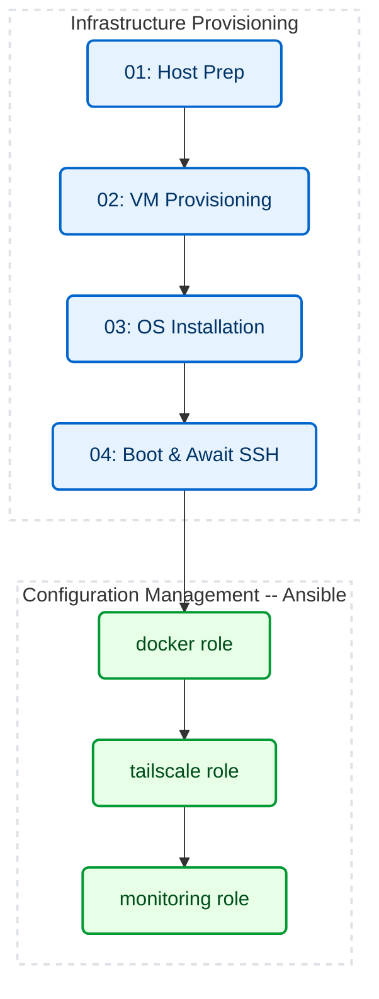

# ZTP Homelab Automation

> An automated Infrastructure-as-Code (IaC) pipeline that provisions, configures, and secures a headless Ubuntu Server node via VirtualBox on a Windows host.

---

## 🚀 Overview

An Infrastructure-as-Code (IaC) pipeline that provisions a headless Linux home server via VirtualBox on a Windows host.

The pipeline automates the entire lifecycle: hypervisor provisioning, unattended OS installation, VPN routing, and Docker stack deployment.

---

## 🛑 The Problem

- **Broken display:** The Ubuntu installer prompts for disk, bootloader, and credentials before networking exists — none answerable on this machine.
- **GUI provisioning:** VM specs set through the VirtualBox wizard aren't versioned, reviewable, or repeatable.
- **Inbound access:** Reaching SSH from outside the LAN requires a router port-forward to the VM.
- **Hypervisor-side monitoring:** VirtualBox's metrics keep no history and can only be read at the host's screen.

---

## 🛠️ Architecture & Workflow



PowerShell provisions the machine. Ansible configures it. `Deploy-Node.ps1` runs both.

The split is by tool boundary, not file numbering — stage 04 drives `VBoxManage`, so it stays PowerShell despite running last. The move to Ansible wasn't about the tool's reputation: the same defect, a native command failing while PowerShell carried on to print a success banner, got fixed by hand in four separate scripts. In Ansible a play halts at the failing task and names it. It bought failure reporting and provable idempotency — not scale, speed, or capability. There is one node.

| Layer | Technology | Role |
|---|---|---|
| **Hypervisor** | VirtualBox 7+ | Runs the node headless |
| **Provisioning** | PowerShell | Drives `VBoxManage`, `diskpart`, `bcdedit` |
| **OS Automation** | Cloud-Init / Subiquity | Unattended install, seeded from a temporary disk |
| **Configuration** | Ansible | Declarative desired state, run from WSL |
| **Secure Access** | Tailscale | Mesh VPN, no inbound ports |
| **Observability** | Docker / Prometheus / Grafana | Metrics scraped from the VM |

---

## 📂 Repository Structure

```text
📦 ztp-homelab/
│
├── ⚙️ Deploy-Node.ps1           # Master execution entrypoint
│
├── 📁 config/                   # Single source of truth: VM name, hardware sizing, ISO URL
│
├── 📁 scripts/                  # 01-04: provision the machine (PowerShell)
│   └── 📁 cloud-init/           # Unattended Ubuntu autoinstall configuration
│
├── 📁 ansible/                  # Configure the running node (docker, tailscale, monitoring)
│
├── 📁 monitoring/               # Observability configuration
│   └── 🐳 docker-compose.yml    # Prometheus & Grafana stack
│
├── 📁 docs/                     # Changelog, troubleshooting, roadmap, Ansible setup
│
└── 📁 logs/                     # Per-stage execution transcripts (gitignored)
```

---

## 🧠 Key Engineering Decisions

| Decision | Why |
|---|---|
| **Provisioning ≠ configuration** | PowerShell drives Windows tooling. Ansible owns desired state. Stage 04 runs `VBoxManage`, so it stays PowerShell |
| **Idempotency is proved, not claimed** | A second run must report `changed=0`. The Grafana password persists on the control node so it cannot rotate and break that |
| **Secrets never enter git** | The SSH key renders into a throwaway `user-data`. Grafana and Tailscale credentials stay on the control node, gitignored |
| **Every run recovers** | Stale media registrations and `known_hosts` pins cleared on rebuild. Mounted VHDs released in a `finally` |
| **No silent success** | `$LASTEXITCODE` checked after every native call. The install loop fails on a deadline instead of hanging |
| **NAT over bridged** | Bridged Wi-Fi stalled Docker pulls at ~50% after an hour. NAT + `virtio` measured ~210-290 Mbps |

Each of these came from a failure. The ones with a root-cause writeup are in [TROUBLESHOOTING.md](docs/TROUBLESHOOTING.md).

---

## ⚡ Execution

**Required:** an Ansible control node on WSL **1**. One-time setup — [ANSIBLE-SETUP.md](docs/ANSIBLE-SETUP.md). Miss it and the pipeline provisions the VM, then stops and says so.

**Optional:** a Tailscale auth key, for unattended tailnet enrolment. Generate your own (Settings → Keys, **reusable**), then:

```bash
echo 'tskey-auth-...' > ansible/.tailscale_auth_key   # gitignored, never committed
```

Without it, approve the device in a browser once. VirtualBox and the ISO are handled by stage 01.

Then, **as Administrator**:

```powershell
.\Deploy-Node.ps1
```

Prompts once for the node's `sudo` password. Re-running the playbook alone should report `changed=0`:

```bash
cd ansible && ANSIBLE_CONFIG=$PWD/ansible.cfg ansible-playbook site.yml -K
```

---

## 📈 Metrics

| Metric | Manual Provisioning | Automated Pipeline |
|---|---|---|
| **Time to provision** | 20-30 minutes, interactive (est.) | 3 min 53 s to a booted OS; 7 min 35 s for the full pipeline including Tailscale and the monitoring stack (single end-to-end run, 2 vCPU / 4 GB guest) |
| **Reproducibility** | Undocumented manual steps | Single command against `config/node.json` |
| **Remote access** | Router port forwarding | Tailscale mesh VPN, zero inbound ports |
| **Host visibility** | No history, host screen only | `node_exporter` scraped every 15s, viewable from any device on the tailnet |

---

## 📚 Documentation
- [CHANGELOG.md](docs/CHANGELOG.md) - Version history and bug fixes.
- [TROUBLESHOOTING.md](docs/TROUBLESHOOTING.md) - Detailed root-cause analysis for advanced edge cases.
- [ROADMAP.md](docs/ROADMAP.md) - Tracker: what is built, what is next, what is deliberately not being built.
- [ANSIBLE-SETUP.md](docs/ANSIBLE-SETUP.md) - Control-node prerequisites on Windows, and why WSL 1 rather than WSL 2.

---

## ⚙️ CI/CD Pipeline

Three jobs run in parallel on every push and PR. The same checks run locally:

```powershell
Invoke-ScriptAnalyzer -Path . -Recurse -Severity Error,Warning -ExcludeRule PSUseBOMForUnicodeEncodedFile

cp monitoring/.env.example monitoring/.env
docker compose -f monitoring/docker-compose.yml config
```

```bash
cd ansible
ANSIBLE_CONFIG=$PWD/ansible.cfg ansible-playbook site.yml --syntax-check
ansible-lint
```

CI only reads the code. It never builds a VM or connects to a node, so a green check means the syntax is valid — not that the pipeline works.

> [!IMPORTANT]
> The real test is running `site.yml` twice. The second run must report `changed=0`.
