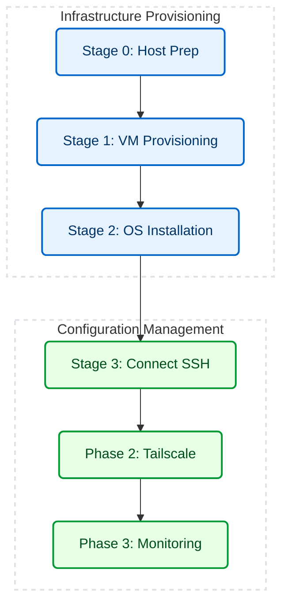

# Zero-Touch Provisioning (ZTP) Homelab Automation

> A fully automated Infrastructure-as-Code (IaC) pipeline that provisions, configures, and secures a headless Ubuntu Server node via VirtualBox on a Windows host.

---

## 🚀 What I Built

A sysops automation pipeline that transforms an old, unused Windows laptop into a fully functional, headless Linux home server in under 10 minutes. 

**One single command** orchestrates the entire lifecycle: downloading the OS, provisioning the hypervisor, executing a 100% headless unattended installation, configuring networking, establishing a secure VPN, and deploying a containerized monitoring stack.

---

## 🛑 The Problem

I wanted to repurpose an old Windows laptop with a broken screen into a headless home server accessible via iPad/phone. However:
- **No Screen:** Manually setting up a VM requires a working screen to click through OS GUI installers.
- **Wi-Fi Bridging Packet Drops:** VirtualBox bridged networking over Wi-Fi is notoriously unstable, causing "dial-up" speeds and massive packet loss.
- **Remote Access:** Reaching the server from a phone/iPad typically requires complex, insecure router port forwarding.

---

## 🛠️ Architecture & Workflow



<br>

| Layer | Technology | Role |
|---|---|---|
| **Hypervisor** | VirtualBox 7+ | Headless virtualization backend. |
| **Orchestration** | PowerShell | Main execution engine enforcing idempotency and state checks. |
| **OS Automation** | Cloud-Init / Subiquity | Injected via a temporary virtual disk to pre-answer all Ubuntu installer prompts. |
| **Secure Access** | Tailscale | Zero-trust mesh VPN for remote SSH/Web access without router configuration. |
| **Observability** | Docker / Prometheus / Grafana | Containerized telemetry stack for hardware metrics. |

---

## 📂 Repository Structure

```text
ztp-homelab/
│
├── Deploy-Node.ps1                     # Master orchestrator script
├── README.md                           # Project documentation
├── .gitignore                          # Git ignore rules for logs & VHDs
│
├── scripts/                            # Core PowerShell automation scripts
│   │
│   ├── 01-host-prep.ps1                # Disables Hyper-V, installs VirtualBox
│   ├── 02-provision-node.ps1           # Creates the VM & virtual disk
│   ├── 03-autoinstall-node.ps1         # Injects cloud-init for headless install
│   ├── 04-connect-node.ps1             # Boots VM and retrieves IP
│   ├── 05-setup-tailscale.ps1          # Automates Tailscale mesh VPN setup
│   ├── 06-setup-monitoring.ps1         # Deploys Docker observability stack
│   │
│   └── cloud-init/                     # Ubuntu automated installation configs
│       ├── user-data                   # OS config, users, SSH keys, packages
│       └── meta-data                   # Instance metadata
│
├── monitoring/                         # Observability configuration
│   ├── docker-compose.yml              # Prometheus & Grafana stack
│   └── prometheus.yml                  # Metrics scraping configuration
│
├── docs/                               # Supplemental documentation
│   ├── CHANGELOG.md                    # Version history
│   └── TROUBLESHOOTING.md              # Known edge-cases and fixes
│
└── logs/                               # Auto-generated execution transcripts
```
---

## 🧠 Key Engineering Decisions

| Challenge | Engineering Solution |
|---|---|
| **Wi-Fi Bridging Packet Drops** | VirtualBox Bridged adapters drop packets on old Wi-Fi cards. Switched to a **NAT topology with `virtio` drivers** and automated localhost Port Forwarding. |
| **Interactive OS Install Prompts** | Ubuntu Server halts to ask where to install GRUB. Injected **`debconf_selections` via Cloud-Init** to force a completely headless installation. |
| **32-bit PowerShell Execution** | Windows silently redirects 32-bit processes, breaking SSH. Implemented **dynamic `$env:WINDIR\sysnative` path resolution** to guarantee execution. |
| **Silent `sudo` Failures** | Background SSH scripts crash when `sudo` requires a password. Added the **`-t` pseudo-TTY flag** to SSH commands to securely pass interactive prompts. |
| **Package Manager Lockups** | Interruptions corrupt the `apt` state. Added a **`dpkg --configure -a` fail-safe** to self-heal package managers before Docker installation. |

---

## ⚡ Execution

The entire pipeline is wrapped in a master orchestrator.

**Open PowerShell as Administrator** and execute:
```powershell
.\Deploy-Node.ps1
```
*(The orchestrator will automatically pause and poll the VM state while the background OS installation finishes).*

---

## 📈 Outcomes

| Metric | Before (Manual) | After (Automated) |
|---|---|---|
| **Time to provision server** | 20-30 minutes (requires screen) | ~8 minutes (100% headless) |
| **Network throughput** | 2-5 Mbps (Bridged Wi-Fi drops) | 800+ Mbps (NAT + Virtio) |
| **Remote Access Setup** | Complex Router Port Forwarding | Instant (Tailscale mesh VPN) |

---

## 📚 Documentation
- [CHANGELOG.md](docs/CHANGELOG.md) - Version history and bug fixes.
- [TROUBLESHOOTING.md](docs/TROUBLESHOOTING.md) - Detailed root-cause analysis for advanced edge cases.
