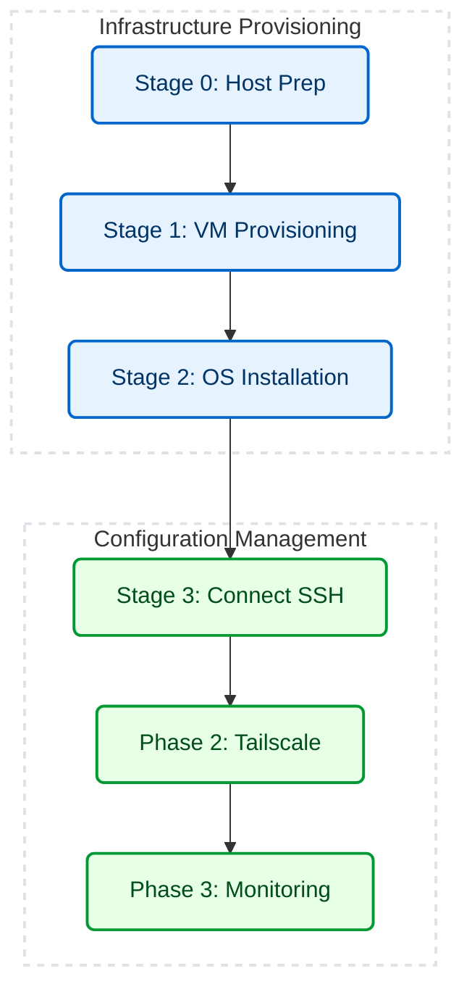

# Zero-Touch Provisioning (ZTP) Homelab Automation 🏡

> A fully automated Infrastructure-as-Code (IaC) pipeline that provisions, configures, and secures a headless Ubuntu Server node via VirtualBox on a Windows host.

---

## 🚀 What I Built

An Infrastructure-as-Code (IaC) pipeline that transforms a broken-screen Windows laptop into a headless Linux home server in under 10 minutes.

**One single command** handles the entire lifecycle: hypervisor provisioning, unattended OS installation, VPN routing, and Docker stack deployment.


---

## 🛑 The Problem

- **Broken hardware:** Repurposing a laptop with a broken screen required a 100% headless VM installation
- **Unstable networking:** VirtualBox bridged Wi-Fi adapters suffer from massive packet loss
- **Remote access:** Securely reaching the server from outside the network usually requires insecure router port-forwarding


---

## 🧠 Key Engineering Decisions

| Area | Detail |
|---|---|
| **Zero-Touch Provisioning** | Injected `debconf_selections` via Cloud-Init to force 100% headless OS installations |
| **Network Virtualization** | NAT topology + `virtio` drivers fixed bridged Wi-Fi packet drops (5 Mbps → 800+ Mbps) |
| **Resilient Orchestration** | PowerShell state-checking and `dpkg` auto-repair ensure the pipeline self-heals from interruptions |
| **Process Bypasses** | Dynamic `$env:WINDIR\sysnative` bypasses 32-bit Windows redirection for native 64-bit SSH execution |
| **Zero-Trust Access** | Tailscale mesh VPN enables secure, instant remote access without complex router port-forwarding |

---

## 🛠️ Architecture & Workflow


| Layer | Technology | Role |
|---|---|---|
| **Hypervisor** | VirtualBox 7+ | Headless virtualization backend. |
| **Orchestration** | PowerShell | Main execution engine enforcing idempotency and state checks. |
| **OS Automation** | Cloud-Init / Subiquity | Injected via a temporary virtual disk to pre-answer all Ubuntu installer prompts. |
| **Secure Access** | Tailscale | Zero-trust mesh VPN for remote SSH/Web access without router configuration. |
| **Observability** | Docker / Prometheus / Grafana | Containerized telemetry stack for hardware metrics. |

---

## 📂 Repository Structure

```text
📦 ztp-homelab/
│
├── ⚙️ Deploy-Node.ps1           # Master execution entrypoint
│
├── 📁 scripts/                  # Modular PowerShell IaC stages (Provisioning, Networking, etc.)
│   └── ☁️ cloud-init/           # Headless Ubuntu autoinstall configurations
│
├── 📁 monitoring/               # Observability configuration
│   └── 🐳 docker-compose.yml    # Prometheus & Grafana stack
│
├── 📁 docs/                     # Architecture & troubleshooting documentation
└── 📁 logs/                     # Auto-generated execution transcripts
```
---

## ⚡ Execution

The entire pipeline is wrapped in a master orchestrator.

**Open PowerShell as Administrator** and execute:
```powershell
.\Deploy-Node.ps1
```
*(The orchestrator will automatically pause and poll the VM state while the background OS installation finishes).*

---

## 📈 Outcomes

| Metric | Before (Manual) | After (Automated) |
|---|---|---|
| **Time to provision server** | 20-30 minutes (requires screen) | ~8 minutes (100% headless) |
| **Network throughput** | 2-5 Mbps (Bridged Wi-Fi drops) | 800+ Mbps (NAT + Virtio) |
| **Remote Access Setup** | Complex Router Port Forwarding | Instant (Tailscale mesh VPN) |

---

## 📚 Documentation
- [CHANGELOG.md](docs/CHANGELOG.md) - Version history and bug fixes.
- [TROUBLESHOOTING.md](docs/TROUBLESHOOTING.md) - Detailed root-cause analysis for advanced edge cases.
