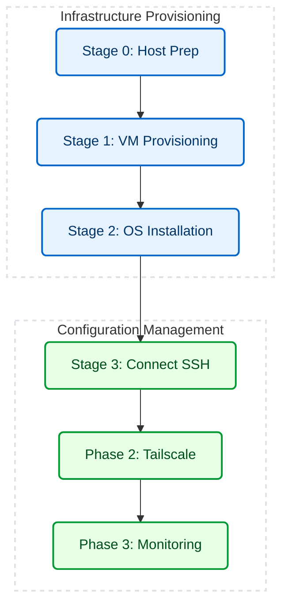

# ZTP Homelab Automation

> An automated Infrastructure-as-Code (IaC) pipeline that provisions, configures, and secures a headless Ubuntu Server node via VirtualBox on a Windows host.

---

## 🚀 Overview

An Infrastructure-as-Code (IaC) pipeline that provisions a headless Linux home server via VirtualBox on a Windows host.

The pipeline automates the entire lifecycle: hypervisor provisioning, unattended OS installation, VPN routing, and Docker stack deployment.

---

## 🛑 The Problem

- **Broken display:** The Ubuntu installer prompts for disk, bootloader, and credentials before networking exists — none answerable on this machine.
- **GUI provisioning:** VM specs set through the VirtualBox wizard aren't versioned, reviewable, or repeatable.
- **Inbound access:** Reaching SSH from outside the LAN requires a router port-forward to the VM.
- **Hypervisor-side monitoring:** VirtualBox's metrics keep no history and can only be read at the host's screen.

---

## 🛠️ Architecture & Workflow



| Layer | Technology | Role |
|---|---|---|
| **Hypervisor** | VirtualBox 7+ | Headless virtualization backend. |
| **Orchestration** | PowerShell | Main execution engine enforcing idempotency and state checks. |
| **OS Automation** | Cloud-Init / Subiquity | Injected via a temporary virtual disk to pre-answer the Ubuntu installer's prompts. One exception -- Subiquity's destructive-disk confirmation -- is cleared by a keystroke; see [TROUBLESHOOTING.md](docs/TROUBLESHOOTING.md). |
| **Secure Access** | Tailscale | Zero-trust mesh VPN for remote SSH/Web access without router configuration. |
| **Observability** | Docker / Prometheus / Grafana | Containerized telemetry stack for hardware metrics. |

---

## 📂 Repository Structure

```text
📦 ztp-homelab/
│
├── ⚙️ Deploy-Node.ps1           # Master execution entrypoint
│
├── 📁 config/                   # Single source of truth: VM name, hardware sizing, ISO URL
│
├── 📁 scripts/                  # Modular PowerShell IaC stages (Provisioning, Networking, etc.)
│   └── 📁 cloud-init/           # Headless Ubuntu autoinstall configurations
│
├── 📁 monitoring/               # Observability configuration
│   └── 🐳 docker-compose.yml    # Prometheus & Grafana stack
│
├── 📁 docs/                     # Architecture & troubleshooting documentation
│
└── 📁 logs/                     # Auto-generated execution transcripts
```

---

## 🧠 Key Engineering Decisions

| Area | Detail |
|---|---|
| **Single Source of Truth** | `config/node.json` centralizes VM name, RAM, CPU cores, disk size, and ISO URL -- every stage reads the same file instead of carrying its own hardcoded defaults |
| **Zero-Touch Provisioning** | Cloud-init seeded from a generated FAT32 `CIDATA` disk: `grub_dpkg` pre-answers the bootloader prompt, and the host's SSH public key is rendered into a throwaway copy of `user-data` under the lab directory -- never back into the tracked template, so a real key never enters git |
| **Network Virtualization** | NAT + `virtio` replaced bridged Wi-Fi, which stalled Docker pulls at ~50% after an hour; ~220 Mbps measured after |
| **Resilient Orchestration** | Re-runnable from any state: stale VirtualBox media registrations and `known_hosts` pins are cleared before rebuild, the cloud-init disk is detached in a `finally` so a mid-run failure cannot strand a mounted VHD, `$LASTEXITCODE` is checked after every `VBoxManage` call that must succeed, and the install wait-loop fails on a deadline instead of hanging |
| **Process Bypasses** | Dynamic `$env:WINDIR\sysnative` bypasses 32-bit Windows redirection for native 64-bit SSH execution |
| **Zero-Trust Access** | Tailscale mesh VPN enables secure remote access (one-time browser device approval) without complex router port-forwarding |

---

## ⚡ Execution

The entire pipeline is wrapped in a master orchestrator.

**Open PowerShell as Administrator** and execute:
```powershell
.\Deploy-Node.ps1
```
*(The orchestrator will automatically pause and poll the VM state while the background OS installation finishes).*

---

## 📈 Metrics

| Metric | Manual Provisioning | Automated Pipeline |
|---|---|---|
| **Time to provision** | 20-30 minutes, interactive (est.) | 3 min 53 s to a booted OS; 7 min 35 s for the full pipeline including Tailscale and the monitoring stack (single end-to-end run, 2 vCPU / 4 GB guest) |
| **Reproducibility** | Undocumented manual steps | Single command against `config/node.json` |
| **Remote access** | Router port forwarding | Tailscale mesh VPN, zero inbound ports |
| **Host visibility** | No history, host screen only | `node_exporter` scraped every 15s, viewable from any device on the tailnet |

---

## 📚 Documentation
- [CHANGELOG.md](docs/CHANGELOG.md) - Version history and bug fixes.
- [TROUBLESHOOTING.md](docs/TROUBLESHOOTING.md) - Detailed root-cause analysis for advanced edge cases.

---

## ⚙️ CI/CD Pipeline

GitHub Actions runs parallel jobs on every push/PR to validate the infrastructure code: lint the PowerShell orchestration scripts (`PSScriptAnalyzer`) → validate the Docker Compose stack syntax (`docker compose config`). A failing check in either job catches syntax errors before deployment. Run the same checks locally with:

```powershell
# 1. Lint PowerShell scripts (same rule set as CI)
Invoke-ScriptAnalyzer -Path . -Recurse -Severity Error,Warning -ExcludeRule PSUseBOMForUnicodeEncodedFile

# 2. Validate Docker Compose config
cp monitoring/.env.example monitoring/.env
docker compose -f monitoring/docker-compose.yml config
```
