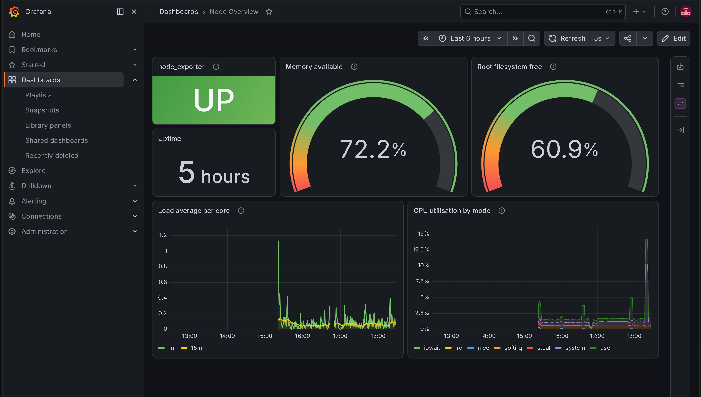
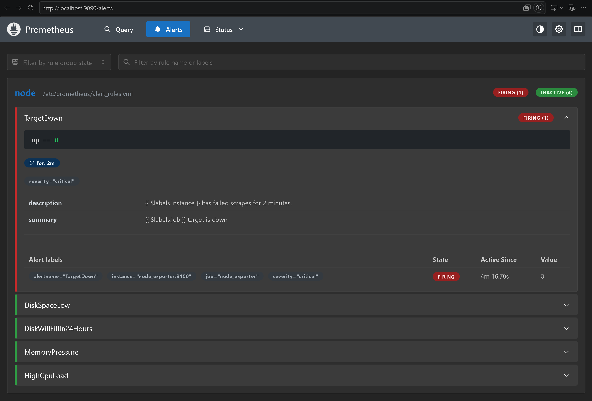
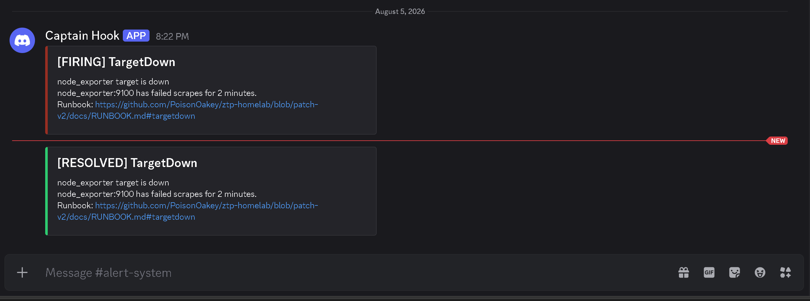
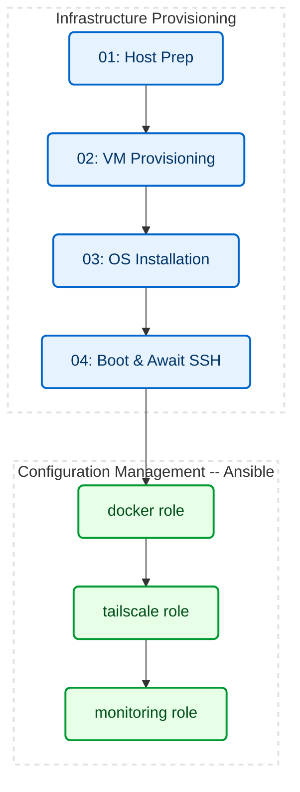

# ZTP — Zero-Touch Provisioning Pipeline

<p align="center">
  
</p>

> One command takes a bare hypervisor to a Linux node that is installed, configured, monitored, and alerting — with no human input.

---

## 🚀 Overview

Infrastructure as Code across four layers, each owned by the tool that should own it:

| | |
|---|---|
| **Provision** | PowerShell drives the hypervisor, disk and boot media. Idempotent, exit-code checked, fails on a deadline rather than hanging |
| **Install** | cloud-init performs an unattended Ubuntu install from a generated seed disk, with the operator's SSH key injected at build time |
| **Configure** | Ansible brings the running node to desired state — Docker, Tailscale, and a monitoring stack. A second run reports zero changes |
| **Observe** | Prometheus scrapes the host, Grafana is provisioned as code, and five alert rules route through Alertmanager to a human with a [runbook](docs/RUNBOOK.md) attached |

The hypervisor here is VirtualBox on a Windows host, which makes the provisioning layer platform-specific by design. The configuration layer is not: the Ansible roles target any Debian-family host, and only the inventory is lab-specific.

---

## 🛑 The Problem

- **Broken display:** The Ubuntu installer prompts for disk, bootloader, and credentials before networking exists — none answerable on this machine.
- **GUI provisioning:** VM specs set through the VirtualBox wizard aren't versioned, reviewable, or repeatable.
- **Inbound access:** Reaching SSH from outside the LAN requires a router port-forward to the VM.
- **Hypervisor-side monitoring:** VirtualBox's metrics keep no history and can only be read at the host's screen.

---

## 📸 The Result

After the pipeline finishes, this is what is already running.



Datasource and dashboard are provisioned from this repository, never clicked in. Panels mirror the alert rules, so what is watched and what pages you are the same signals.



`node_exporter` stopped on purpose. `TargetDown` waited out its `for: 2m` grace period, then fired with the labels defined in [`alert_rules.yml`](monitoring/alert_rules.yml). The other four rules stayed quiet.



Firing, then resolved once the container came back — an alert that never closes is as useless as one that never opens. The runbook link rides on the notification itself.

---

## 🛠️ Architecture & Workflow



PowerShell provisions the machine. Ansible configures it. `Deploy-Node.ps1` runs both.

The split follows tool boundaries, not file order — stage 04 drives `VBoxManage`, so it stays PowerShell despite running last. Ansible earned the second half after one bug — a native command failing while PowerShell printed a success banner — was patched by hand in four separate scripts. A play halts at the failing task and names it: failure reporting and provable idempotency, not scale. There is one node.

| Layer | Technology | Role |
|---|---|---|
| **Hypervisor** | VirtualBox 7+ | Runs the node headless |
| **Provisioning** | PowerShell | Drives `VBoxManage`, `diskpart`, `bcdedit` |
| **OS Automation** | Cloud-Init / Subiquity | Unattended install, seeded from a temporary disk |
| **Configuration** | Ansible | Declarative desired state, run from WSL |
| **Secure Access** | Tailscale | Mesh VPN, no inbound ports |
| **Observability** | Prometheus / Grafana / node_exporter | Host metrics from the VM, dashboard provisioned as code |
| **Alerting** | Prometheus rules / Alertmanager | Five rules, grouped and routed to Discord, each linked to a [runbook](docs/RUNBOOK.md) |

---

## 📂 Repository Structure

```text
📦 ztp-linux-node/
│
├── ⚙️ Deploy-Node.ps1           # Master execution entrypoint
│
├── 📁 config/                   # Single source of truth: VM name, hardware sizing, ISO URL
│
├── 📁 scripts/                  # 01-04: provision the machine (PowerShell)
│   └── 📁 cloud-init/           # Unattended Ubuntu autoinstall configuration
│
├── 📁 ansible/                  # Configure the running node (docker, tailscale, monitoring)
│
├── 📁 monitoring/               # Observability configuration
│   └── 🐳 docker-compose.yml    # Prometheus & Grafana stack
│
├── 📁 docs/                     # Changelog, troubleshooting, roadmap, Ansible setup
│
└── 📁 logs/                     # Per-stage execution transcripts (gitignored)
```

---

## 🧠 Key Engineering Decisions

| Decision | Why |
|---|---|
| **Provisioning ≠ configuration** | PowerShell drives Windows tooling. Ansible owns desired state. Stage 04 runs `VBoxManage`, so it stays PowerShell |
| **Idempotency is proved, not claimed** | A second run must report `changed=0`. The Grafana password persists on the control node so it cannot rotate and break that |
| **Secrets never enter git** | The SSH key renders into a throwaway `user-data`. Grafana and Tailscale credentials stay on the control node, gitignored |
| **Every run recovers** | Stale media registrations and `known_hosts` pins cleared on rebuild. Mounted VHDs released in a `finally` |
| **No silent success** | `$LASTEXITCODE` checked after every native call. The install loop fails on a deadline instead of hanging |
| **NAT over bridged** | Bridged Wi-Fi stalled Docker pulls at ~50% after an hour. NAT + `virtio` measured ~210-290 Mbps |

Each of these came from a failure. The ones with a root-cause writeup are in [TROUBLESHOOTING.md](docs/TROUBLESHOOTING.md).

---

## ⚡ Execution

> [!IMPORTANT]
> **Required —** an Ansible control node on WSL **1**. One-time setup: [ANSIBLE-SETUP.md](docs/ANSIBLE-SETUP.md).
> Miss it and the pipeline provisions the VM, then stops and says so.

> [!TIP]
> **Optional —** a Tailscale auth key, for unattended tailnet enrolment. Generate your own (Settings → Keys, **reusable**), then:
> ```bash
> echo 'tskey-auth-...' > ansible/.tailscale_auth_key   # gitignored, never committed
> ```
> Without one, approve the device in a browser once.

> [!TIP]
> **Optional —** a Discord webhook, so firing alerts reach you instead of sitting on a web page.
> In Discord: a **text** channel → ⚙️ → **Integrations** → **Webhooks** → **New Webhook** → **Copy Webhook URL**, then:
> ```bash
> echo 'https://discord.com/api/webhooks/...' > ansible/.discord_webhook_url   # gitignored
> ```
> Without one, Alertmanager still groups and silences alerts — it just does not send them anywhere.

VirtualBox and the ISO are handled by stage 01. Then, **as Administrator**:

```powershell
.\Deploy-Node.ps1
```

Prompts once for the node's `sudo` password. Re-running the playbook alone should report `changed=0`:

```bash
cd ansible && ANSIBLE_CONFIG=$PWD/ansible.cfg ansible-playbook site.yml -K
```

### Access

| | |
|---|---|
| **Grafana** | http://localhost:3000 — user `admin`, dashboard already provisioned |
| **Prometheus** | http://localhost:9090 — `/targets` for scrape health, `/alerts` for rule state |
| **Alertmanager** | http://localhost:9093 — grouped alerts and silences |
| **SSH** | `ssh -p 2222 sysadmin@127.0.0.1` |

The Grafana password is generated on the first run and reused after that. It lives on your machine only — gitignored, never in the repo:

```bash
cat ansible/.grafana_admin_password
```

---

## 📈 Metrics

| Metric | Manual Provisioning | Automated Pipeline |
|---|---|---|
| **Time to provision** | 20-30 minutes, interactive (est.) | 3 min 53 s to a booted OS; 7 min 35 s for the full pipeline including Tailscale and the monitoring stack (single end-to-end run, 2 vCPU / 4 GB guest) |
| **Reproducibility** | Undocumented manual steps | Single command against `config/node.json` |
| **Remote access** | Router port forwarding | Tailscale mesh VPN, zero inbound ports |
| **Host visibility** | No history, host screen only | `node_exporter` scraped every 15s, viewable from any device on the tailnet |

---

## 📚 Documentation
- [CHANGELOG.md](docs/CHANGELOG.md) - Version history and bug fixes.
- [TROUBLESHOOTING.md](docs/TROUBLESHOOTING.md) - Detailed root-cause analysis for advanced edge cases.
- [RUNBOOK.md](docs/RUNBOOK.md) - One section per alert: what it means, how to confirm it, what to do.
- [ROADMAP.md](docs/ROADMAP.md) - Tracker: what is built, what is next, what is deliberately not being built.
- [ANSIBLE-SETUP.md](docs/ANSIBLE-SETUP.md) - Control-node prerequisites on Windows, and why WSL 1 rather than WSL 2.

---

## ⚙️ CI/CD Pipeline

Three jobs run in parallel on every push and PR. The same checks run locally:

```powershell
Invoke-ScriptAnalyzer -Path . -Recurse -Severity Error,Warning -ExcludeRule PSUseBOMForUnicodeEncodedFile

cp monitoring/.env.example monitoring/.env
docker compose -f monitoring/docker-compose.yml config
```

```bash
cd ansible
ANSIBLE_CONFIG=$PWD/ansible.cfg ansible-playbook site.yml --syntax-check
ansible-lint
```

CI only reads the code. It never builds a VM or connects to a node, so a green check means the syntax is valid — not that the pipeline works.

> [!IMPORTANT]
> The real test is running `site.yml` twice. The second run must report `changed=0`.
